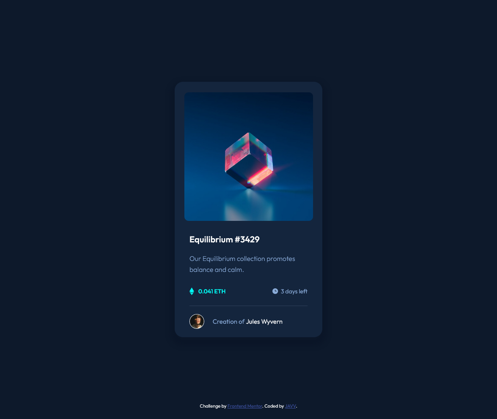
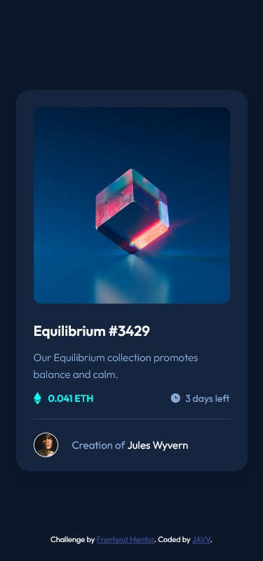

# NFT Preview Card Component - Frontend Mentor

Hello everyone👋! Welcome to my repository. This is my solution to the [NFT preview card component challenge on Frontend Mentor](https://www.frontendmentor.io/challenges/nft-preview-card-component-SbdUL_w0U). 

## Table of contents

- [Overview](#overview)
  - [The challenge](#the-challenge)
  - [Screenshot](#screenshot)
  - [Links](#links)
- [My process](#my-process)
  - [Built with](#built-with)
  - [What I learned](#what-i-learned)
- [Author](#author)

## Overview

### The challenge

Users should be able to:

- View the optimal layout depending on their device's screen size
- See hover states for interactive elements




### Links

- Solution URL: [Github](https://github.com/daisukeeita/NFT-Card-Preview-Component)
- Live Site URL: [NFT Card Preview Component](https://daisukeeita.github.io/NFT-Card-Preview-Component/)

## My process

### Built with

- Semantic HTML5 markup
- CSS custom properties
- Flexbox
- Mobile-first workflow

### What I learned

What I learned is the continuation of manipulating images in a single `div`. You can hide the images by using `display`, `opacity`, or `visibility` based on what I learned so far. But if you want to make an animation, `opacity` is the best choice. But there might be another approach when it comes to animation, after all, there is so much solution to just one problem. 

```css
.nft-container__image-container {
    position:      relative;
    margin-bottom: 25px;
}

.nft-container__image-container:hover .view-container{
    opacity: 1;
    z-index: 10;
}

.view-container {
    position:         absolute;
    left:             50%;
    transform:        translate(-50%, -50%);
    top:              50%;
    width:            inherit;
    height:           inherit;
    border-radius:    inherit;
    opacity:          0;
    transition:       all 200ms linear;
    z-index:          -1;
    background-color: var(--primary-color-hover);
}
```

## Author

- Frontend Mentor - [@daisukeeita](https://www.frontendmentor.io/profile/daisukeeita)